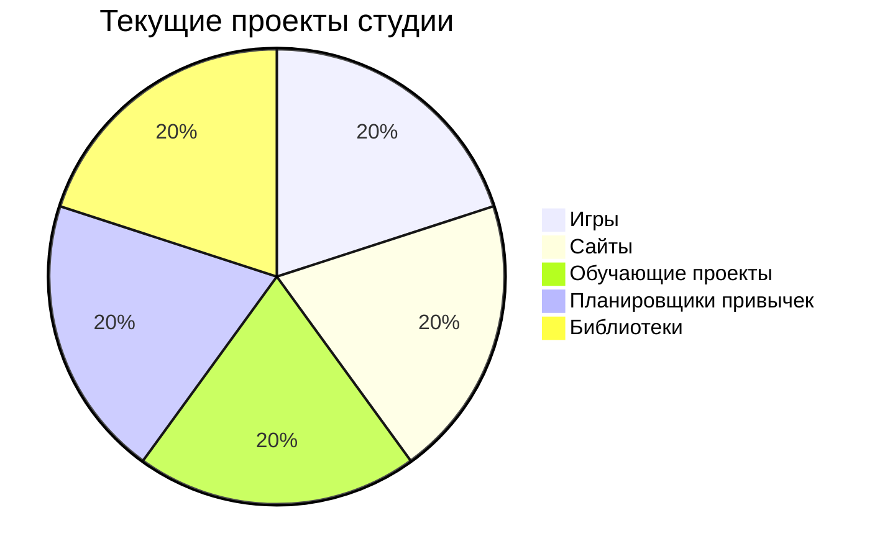

<div align="center">
  <h1>🛠️ Forge of Ovordule - Официальный сайт</h1>
  <p>Цифровая визитка творческой студии | Разработка на старте</p>
  
  [](LICENSE)
  [](https://forge-of-ovorldule.github.io/Forge-of-Ovorldule/)
  []()
</div>

---

## 🧪 О проекте
**Официальный сайт студии Forge of Ovordule** - отправная точка нашего цифрового присутствия. Сейчас в разработке:



---

## 🔥 Особенности сайта (в разработке)

### 🎮 Будущая функциональность
```diff
+ В планах
- Реализовано
```
- [ ] Интерактивное портфолио проектов  
- [ ] Галерея скриншотов и демо  
- [ ] Система новостей и обновлений  
- [ ] Раздел "Команда" с профилями  

---

## 🛠️ Технологии разработки
<div align="center">
  
</div>

| Категория       | Инструменты                          |
|-----------------|--------------------------------------|
| **Основные**    | JavaScript, HTML5, CSS3              |
| **Публикация**  | GitHub Pages                         |
| **Дизайн**      | Blender (3D-графика)                 |
| **ИИ-ассистент**| DeepSeek (оптимизация кода)          |

---

## 🌐 Доступные разделы
Единственная доступная страница:  
[Главная страница](https://forge-of-ovorldule.github.io/Forge-of-Ovorldule/)

---

## 🤝 Присоединиться
Следите за нашим развитием:
- [](https://github.com/forge-of-ovorldule)
- [](https://t.me/ForgeOfOvorldule)

---

<div align="center">
  <sub>Создано с ❤️ в Forge of Ovordule | Apache License 2.0</sub>
</div>
